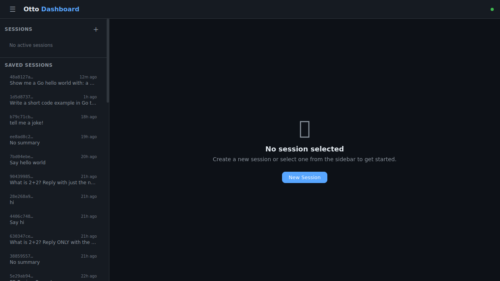
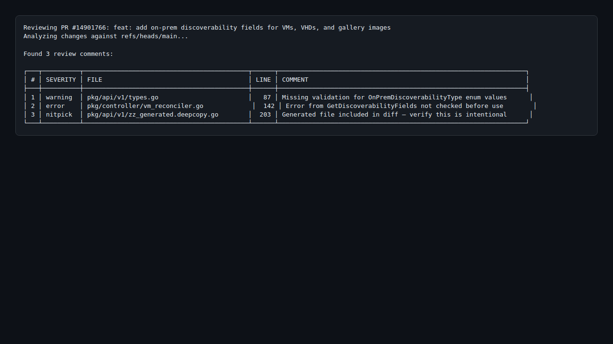
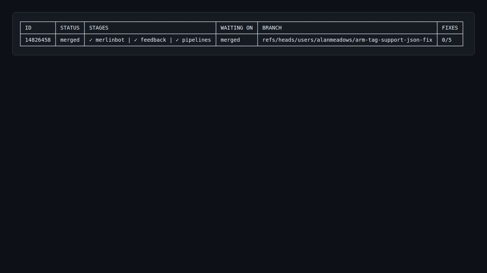

# Otto

[](https://github.com/alanmeadows/otto/actions/workflows/ci.yml)
[](LICENSE)

AI-powered PR lifecycle manager with a Copilot session dashboard.

## Why Otto?

Working with coding agents is powerful, but the surrounding workflow is full of friction. You submit a PR, walk away, and come back to find a failed pipeline, three review comments, a merge conflict, and a MerlinBot policy violation — each requiring you to context-switch back, diagnose, fix, push, and wait again. Meanwhile, your Copilot CLI sessions are trapped in the terminal where you started them.

Otto solves three problems:

### 📱 Drive Copilot from your phone

Otto's web dashboard discovers all your Copilot CLI sessions from `~/.copilot/session-state/`, shows their live status, and lets you resume and interact with them from any browser. Start a session at your desk, pick it up from your phone on the couch. Protected by a secret access key via Azure DevTunnels.



### 🔍 Guided PR reviews with a single command

```bash
otto pr review https://dev.azure.com/org/project/_git/repo/pullrequest/123 \
  "focus on error handling, concurrency safety, and resource cleanup"
```

Not a generic "find bugs" review — you tell otto what to focus on and it applies that lens across the entire diff. Otto checks out the full repo so the LLM can read surrounding code for context, not just the diff. It then presents review comments in a table and lets you interactively select which to post as inline comments on the PR.



### 🤖 Hands-off PR lifecycle management

```bash
otto pr add https://dev.azure.com/org/project/_git/repo/pullrequest/123
```

Otto watches your PR continuously. When a pipeline fails, it reads the build logs, classifies the failure (infrastructure vs code), and fixes it. When a reviewer leaves comments, it evaluates each one, fixes the code if it agrees, and replies with its reasoning. When merge conflicts appear, it rebases and resolves them. When MerlinBot flags policy issues, it addresses them. All while you're working on something else.



The goal: submit a PR and let otto get it to green without you babysitting it.

## Features

- **PR autopilot** — monitors PRs for pipeline failures, review comments, merge conflicts, and MerlinBot feedback; auto-fixes and re-pushes up to configurable max attempts
- **Guided PR review** — LLM-powered code review with focus guidance and interactive inline comment posting
- **Copilot dashboard** — web UI for managing Copilot CLI sessions with real-time streaming, session resume, and live activity monitoring
- **Session sharing** — generate time-limited read-only links to share a single session's live conversation
- **Remote access** — Azure DevTunnel integration with Entra ID, org-scoped, or anonymous access control
- **Session discovery** — automatically discovers persisted sessions with live activity timestamps
- **Notifications** — Microsoft Teams notifications for PR events via Power Automate ([setup guide](docs/notifications.md))
- **Multi-provider** — pluggable PR backends for Azure DevOps and GitHub

## Installation

Requires **Go 1.25.6+** and a [GitHub Copilot subscription](https://github.com/features/copilot).

```bash
git clone https://github.com/alanmeadows/otto.git
cd otto
make build        # produces bin/otto
make install      # installs to ~/.local/bin
```

### Prerequisites

- **GitHub Copilot CLI** — `npm install -g @github/copilot`
- **bgtask** (required for tunnel management) — `go install github.com/philsphicas/bgtask/cmd/bgtask@latest`
- **devtunnel** (optional, for remote access) — install in WSL (`curl -sL https://aka.ms/DevTunnelCliInstall | bash`) or on Windows (`winget install Microsoft.devtunnel`); both `devtunnel` and `devtunnel.exe` are supported

## Quick Start

### 1. Configure

```bash
# Azure DevOps — only org and project needed if you're logged into az CLI
otto config set pr.default_provider "ado"
otto config set pr.providers.ado.organization "myorg"
otto config set pr.providers.ado.project "myproject"

# Otto authenticates via Entra ID (az CLI) automatically — no PAT required.
# Just make sure you're logged in:
az login

# Or GitHub
otto config set pr.default_provider "github"
otto config set pr.providers.github.token "$GITHUB_TOKEN"
```

> **ADO Authentication:** Otto uses `az account get-access-token` to obtain Entra ID bearer tokens automatically. Tokens are cached and refreshed transparently. A PAT is only needed as a fallback if `az cli` is not available — set `OTTO_ADO_PAT` or `pr.providers.ado.pat` in that case.

### 2. Review a PR with guidance

```bash
# Generic review
otto pr review https://github.com/org/repo/pull/42

# Guided review — tell the LLM what to focus on
otto pr review https://github.com/org/repo/pull/42 "focus on error handling and race conditions"
otto pr review https://dev.azure.com/org/proj/_git/repo/pullrequest/123 "check for security issues in input validation"
```

Otto checks out the PR branch locally, analyzes the codebase structure, and creates an LLM session rooted in the repo — so the agent can read any file for context, not just the diff. Your guidance steers its focus. It then presents review comments in a table and lets you interactively select which to post as inline comments on the PR.

### 3. Monitor a PR on autopilot

```bash
# Add a PR for tracking — otto watches it continuously
otto pr add https://dev.azure.com/org/proj/_git/repo/pullrequest/123

# Start the daemon
otto server start
```

Otto will now poll the PR and automatically:
- Fix pipeline failures (classifies as infrastructure vs code, retries or fixes accordingly)
- Respond to review comments (agrees and fixes, or explains why it's by-design)
- Resolve merge conflicts (rebases and resolves via LLM)
- Address MerlinBot policy violations (ADO-specific)
- Send Teams notifications on status changes

### 4. Start the dashboard

```bash
# The dashboard and tunnel are enabled by default.
# Just start the server:
otto server start

# To disable specific features:
otto server start --no-dashboard
otto server start --no-tunnel
otto server start --no-pr-monitoring
```

Open **http://localhost:4098** in your browser. The dashboard shows:
- All persisted Copilot CLI sessions with live "last activity" timestamps
- Resume any session and continue the conversation
- Create new sessions with model selection
- Real-time streaming of LLM responses and tool calls
- Share individual sessions via time-limited read-only links

The tunnel is managed via bgtask so it survives otto restarts. Otto monitors the tunnel health every 2 minutes — if the relay connection drops (process alive but disconnected), otto automatically restarts the tunnel. The dashboard shows the tunnel status and URL when active, and links to the [setup guide](docs/tunnel.md) when inactive. Allowed users can be managed live from the dashboard sidebar.

## Copilot Dashboard

The dashboard is a responsive web UI embedded in the otto binary. It connects to the Copilot SDK to manage sessions and streams events in real time via WebSocket.

### Starting sessions in a repo context

When you create a new session from the dashboard, you can choose a working directory from a dropdown. This dropdown is populated from your tracked repositories — so the Copilot agent starts in the right repo with access to all its files.

To register a repository:

```bash
# Interactive — prompts for directory, git strategy, etc.
otto repo add

# Or add with a name
otto repo add my-project
```

A tracked repo configuration looks like this in `.otto/otto.jsonc`:

```jsonc
{
  "repos": [{
    "name": "my-project",
    "primary_dir": "/home/user/repos/my-project",
    "worktree_dir": "/home/user/repos/my-project-worktrees",
    "git_strategy": "worktree",
    "branch_template": "otto/{{.Name}}"
  }]
}
```

If `worktree_dir` is configured, all git worktrees under that directory appear in the dashboard's working directory picker. This lets you spin up a Copilot session pointed at a specific branch or worktree — useful for working on multiple features in parallel from your phone.

Tracked repos are also used by the PR autopilot to map PR branches to local working directories.

### Session Sharing

Click **🔗 Share** in any active session to generate a share link (configurable expiry and mode):

```
https://your-tunnel.devtunnels.ms/shared/6548666f0382549d...
```

Share links support two modes:
- **Read-only** — the recipient sees the conversation streaming live (tool calls, responses, intent changes) but cannot send messages
- **Read-write** — the recipient enters a nickname and can send messages into the session alongside the owner

### Remote Access

To access the dashboard from your phone, use Azure DevTunnels:

```bash
# One-time setup: install devtunnel and login
# Linux/WSL:
curl -sL https://aka.ms/DevTunnelCliInstall | bash
# Windows (devtunnel.exe is also supported from WSL):
# winget install Microsoft.devtunnel
devtunnel user login -e   # Entra ID (Microsoft), or -g for GitHub
```

Recommended configuration:

```bash
# Persistent tunnel ID — stable URL across restarts
otto config set dashboard.tunnel_id "yourname-otto"

# Start the server — dashboard and tunnel are on by default
otto server start
```

On start, otto logs an access URL with an embedded secret key:

```
tunnel connected — dashboard available remotely  url=https://xxxx-4098.usw3.devtunnels.ms?key=a8f3b2c1...
```

If devtunnel or bgtask aren't installed, otto logs a warning with install instructions and continues without the tunnel. Use `otto server status` to see all active endpoints including the tunnel URL.

See [docs/tunnel.md](docs/tunnel.md) for the full setup guide.

## Configuration

### Config Files

Otto merges configuration from three layers (later layers override earlier):

1. **Built-in defaults** — sensible starting values
2. **User config** — `~/.config/otto/otto.jsonc`
3. **Repo config** — `.otto/otto.jsonc` (in the repository root)

Both config files use [JSONC](https://code.visualstudio.com/docs/languages/json#_json-with-comments) format (JSON with comments).

Use `otto config show` to inspect the merged result and `otto config set <key> <value>` to write values to the repo-local file.

### Example Configs

**User config** (`~/.config/otto/otto.jsonc`) — personal settings shared across all repos:

```jsonc
{
  // Server settings
  "server": {
    "source_dir": "~/clones/otto",       // for upgrade --channel main
    "upgrade_channel": "main"
  },

  // PR autopilot
  "pr": {
    "default_provider": "ado",
    "max_fix_attempts": 5,
    "providers": {
      "ado": {
        // Entra ID auth via az cli — no PAT needed
        "organization": "myorg",
        "project": "MyProject",
        "auto_complete": true,
        "merlinbot": true,
        "create_work_item": true,
        "work_item_area_path": "MyProject\\Team\\Area"
      }
    }
  },

  // Tracked repositories
  "repos": [
    {
      "name": "my-project",
      "primary_dir": "/home/user/repos/my-project",
      "worktree_dir": "/home/user/repos/my-project.worktree",
      "git_strategy": "worktree",
      "branch_template": "users/myalias/{{.Name}}"
    }
  ]
}
```

**Repo config** (`.otto/otto.jsonc`) — repo-specific overrides committed with the project:

```jsonc
{
  // Dashboard & tunnel settings for this project
  "dashboard": {
    "copilot_server": "localhost:4321",
    "tunnel_id": "myname-otto",
    "owner_nickname": "myname",
    "tunnel_access": "tenant"
  },

  // Teams notifications for PR events
  "notifications": {
    "teams_webhook_url": "https://your-power-automate-webhook-url"
  }
}
```

### Configuration Reference

| Key | Type | Default | Description |
|-----|------|---------|-------------|
| `models.primary` | string | `claude-opus-4.6` | Primary LLM model |
| `models.secondary` | string | `gpt-5.2-codex` | Secondary model for multi-model review |
| `pr.default_provider` | string | `ado` | Default PR provider (`ado` or `github`) |
| `pr.max_fix_attempts` | int | `5` | Max auto-fix attempts per PR |
| `pr.providers.ado.organization` | string | | ADO organization name |
| `pr.providers.ado.project` | string | | ADO project name |
| `pr.providers.ado.pat` | string | | ADO personal access token (fallback for `az cli`) |
| `pr.providers.ado.auto_complete` | bool | `false` | Auto-complete ADO PRs |
| `pr.providers.ado.merlinbot` | bool | `false` | Enable MerlinBot integration |
| `pr.providers.ado.create_work_item` | bool | `false` | Create ADO work items for PR fixes |
| `pr.providers.ado.work_item_area_path` | string | | ADO area path for created work items |
| `pr.providers.github.token` | string | | GitHub personal access token |
| `server.poll_interval` | string | `10m` | Daemon PR poll interval |
| `server.port` | int | `4097` | Daemon HTTP API port |
| `server.log_dir` | string | `~/.local/share/otto/logs` | Daemon log directory |
| `server.source_dir` | string | | Path to otto source for `upgrade --channel main` |
| `server.upgrade_channel` | string | `release` | Upgrade channel: `release` (go install @latest) or `main` (build from source) |
| `dashboard.port` | int | `4098` | Dashboard web server port |
| `dashboard.copilot_server` | string | | Connect to shared headless Copilot server (e.g. `localhost:4321`) |
| `dashboard.tunnel_id` | string | | Persistent tunnel name for stable URL across restarts |
| `dashboard.tunnel_access` | string | | Access mode: `anonymous`, `tenant`, or empty (authenticated) |
| `dashboard.tunnel_allow_org` | string | | GitHub org to grant tunnel access |
| `dashboard.owner_email` | string | | Dashboard owner email (auto-detected from tunnel JWT if empty) |
| `dashboard.owner_nickname` | string | `owner` | Display name for session owner in chat bubbles |
| `dashboard.allowed_users` | string[] | | Emails allowed full dashboard access |
| `notifications.teams_webhook_url` | string | | Microsoft Teams webhook URL |
| `notifications.events` | string[] | | Events to notify on |

### Environment Variables

| Variable | Description |
|----------|-------------|
| `OTTO_ADO_PAT` | Azure DevOps personal access token |
| `OTTO_GITHUB_TOKEN` | GitHub personal access token |

## Command Reference

```
otto                          LLM-powered PR lifecycle manager
├── pr                        Manage pull requests
│   ├── add <url>             Track a PR for auto-monitoring
│   ├── list                  List tracked PRs
│   ├── status [id]           Show PR status
│   ├── remove [id]           Stop tracking a PR
│   ├── fix [id]              Manually trigger LLM fix
│   ├── log [id]              Show PR activity log
│   ├── review <url> [guide]  LLM-powered PR review with optional focus guidance
│   └── submit                Submit the current branch as a PR
├── server                    Manage the otto daemon
│   ├── start                 Start the daemon
│   │   ├── --no-dashboard       Disable Copilot session dashboard
│   │   ├── --no-tunnel          Disable Azure DevTunnel
│   │   ├── --no-pr-monitoring   Disable PR monitoring loop
│   │   ├── --dashboard-port     Dashboard port (default: 4098)
│   │   ├── --port            Server port (default: 4097)
│   │   └── --foreground      Run in foreground
│   ├── stop                  Stop the daemon
│   ├── restart               Restart the daemon (via bgtask)
│   ├── upgrade               Stop, install latest, restart (via bgtask)
│   │   └── --channel         "release" (go install @latest) or "main" (source)
│   ├── status                Show daemon status, endpoints, and tunnel URL
│   ├── logs                  Show daemon log file path
│   └── install               Install as systemd user service
├── repo                      Manage repositories
│   ├── add [name]            Register a repository
│   ├── remove <name>         Remove a tracked repository
│   └── list                  List tracked repositories
├── worktree                  Manage git worktrees
├── config                    Manage configuration
│   ├── show [--json]         Show merged configuration
│   └── set <key> <value>     Set a config value
└── completion                Generate shell completions
```

## Architecture

```
┌─────────────────────────────────────────────────────────────┐
│ otto server start                                           │
│                                                             │
│  ┌──────────────────┐   ┌───────────────────────────────┐   │
│  │ PR API (:4097)   │   │ Dashboard (:4098)             │   │
│  │ PR monitoring    │   │ Web UI + WebSocket streaming  │   │
│  │ Auto-fix/review  │   │ Session sharing (token-gated) │   │
│  └──────────────────┘   └───────────────┬───────────────┘   │
│                                         │                   │
│  ┌──────────────────────────────────────┴───────────────┐   │
│  │ Copilot Session Manager (copilot-sdk/go)             │   │
│  │ Create · Resume · Stream · Share                     │   │
│  │ Persisted session discovery (~/.copilot/session-state)│   │
│  └──────────────────────────────────────────────────────┘   │
│                                                             │
│  ┌──────────────────────────────────────────────────────┐   │
│  │ DevTunnel Manager (via bgtask)                       │   │
│  │ Tunnel survives otto restarts · auto-restart always  │   │
│  │ Health monitor auto-recovers stale connections       │   │
│  │ Entra ID / GitHub org / anonymous access control     │   │
│  └──────────────────────────────────────────────────────┘   │
└─────────────────────────────────────────────────────────────┘
```

All LLM interaction goes through the [GitHub Copilot SDK for Go](https://github.com/github/copilot-sdk).

## Development

```bash
make build    # Build binary to bin/otto
make test     # Run all tests
make lint     # Run golangci-lint
make vet      # Run go vet
make all      # lint + vet + test + build
```

## License

[Apache 2.0](LICENSE)
