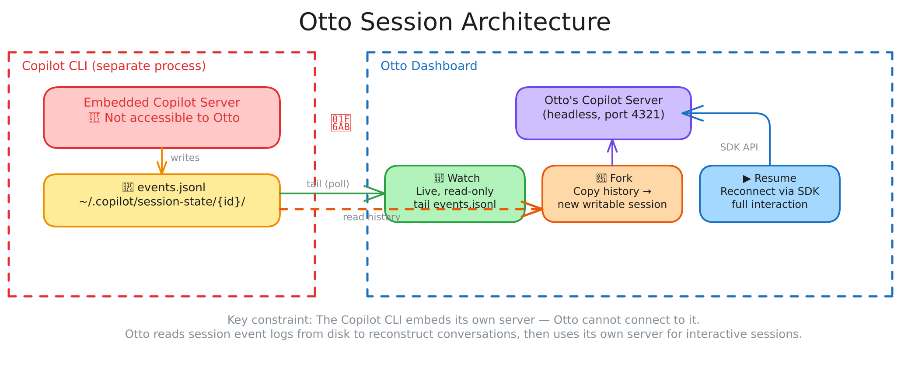

# Session Architecture

Otto's dashboard lets you interact with Copilot CLI sessions from any browser, but there's a fundamental constraint: **the Copilot CLI embeds its own copilot server that Otto cannot connect to**. Each `copilot` process runs an internal server that handles LLM interactions, and there is no API to attach to it from outside.

Otto works around this by reading session data from disk and running its own copilot server for interactive sessions. This creates three distinct session modes.



## The Three Session Modes

### Watch — Live, Read-Only Streaming

When a Copilot CLI session is actively running in a terminal, it writes events to `~/.copilot/session-state/{id}/events.jsonl` in real time. Otto discovers these sessions by scanning the session-state directory every 3 seconds, detecting which sessions have recent activity.

**How it works:** Otto tails the `events.jsonl` file (polling every 500ms), parsing each new line to extract user messages, assistant responses, tool calls, and other events. These are streamed to the dashboard via WebSocket.

**Why it's read-only:** Since Otto can't connect to the CLI's embedded copilot server, it has no way to inject messages into the session. It can only observe what the CLI writes to disk.

**When to use:** You started a session at your desk and want to monitor its progress from your phone. You can see everything the agent is doing — tool calls, reasoning, responses — in real time.

### Fork — Copy History Into a New Session

Forking takes a session you're watching (or a saved session) and creates a new interactive session on Otto's own copilot server, seeded with the conversation history from the original.

**How it works:** Otto reads the full `events.jsonl` from the source session, extracts the user/assistant message pairs, and injects them as context into a brand-new session created via the Copilot SDK on Otto's server (port 4321). The new session starts with a system message: *"The conversation above is history from the original session. You are now in a forked session. Continue from where it left off."*

**Why it exists:** When you're watching a CLI session and want to take over — ask follow-up questions, redirect the agent, or branch the conversation in a different direction — you can't interact with the original. Forking gives you a writable copy that picks up where the original left off.

**When to use:** You're watching a session and the agent is going down the wrong path, or you want to explore an alternative approach without disrupting the original CLI session.

### Resume — Reconnect to a Persisted Session

Resuming reconnects to a previously idle session through Otto's own copilot server, restoring full bidirectional interaction.

**How it works:** Otto uses the Copilot SDK's session resume API, passing the persisted session ID. The SDK loads the session's checkpoint and conversation history, and Otto gets a live session handle with full event streaming and message sending capability.

**Why it exists:** Sessions created through Otto's dashboard (or previously forked/resumed sessions) persist their state. When they go idle, you can come back later and pick up exactly where you left off — the full conversation context is preserved.

**When to use:** You created a session from the dashboard, had a conversation, closed your browser, and want to continue later. Or you forked a CLI session yesterday and want to keep working on it today.

## How Session Discovery Works

Otto discovers sessions from two sources:

1. **Active CLI sessions** — Scans `~/.copilot/session-state/` every 3 seconds. For each session directory, it reads `workspace.yaml` for metadata (summary, timestamps) and checks `checkpoints/index.md` for recent activity. Sessions with activity in the last few minutes appear as "live" in the sidebar.

2. **Otto's own sessions** — Sessions created via the dashboard (new, forked, or resumed) are managed through Otto's copilot server and appear in the active sessions list with full interaction capability.

Both types appear in the dashboard sidebar. Live CLI sessions show a pulsing indicator and enter Watch mode when selected. Otto-managed sessions show their state (idle/processing) and support direct interaction.

## Why Two Copilot Servers?

| | CLI's Embedded Server | Otto's Server (port 4321) |
|---|---|---|
| **Started by** | `copilot` CLI process | Otto via `bgtask` |
| **Accessible to Otto** | No | Yes |
| **Sessions** | CLI terminal sessions | Dashboard sessions (new, fork, resume) |
| **Lifecycle** | Dies with CLI process | Survives otto restarts (bgtask) |
| **Data path** | Writes to `events.jsonl` | SDK API via WebSocket |

Otto starts its own headless copilot server (`copilot --headless --port 4321 --no-auto-update`) as a background task. This server handles all sessions created through the dashboard. The `--no-auto-update` flag prevents it from corrupting `~/.copilot/pkg/` while other CLI instances may be running.

You can point Otto at your own server instead:

```bash
otto config set dashboard.copilot_server localhost:5000
```

## Session Mode Flow

The diagram at the top of this document illustrates the full data flow. A typical usage pattern:

A typical flow: you start a Copilot session at your desk, otto discovers it and you **watch** it from your phone. The agent asks a question you want to answer — you **fork** the session and respond. Later, the forked session goes idle and you close your browser. The next morning you open the dashboard and **resume** it to continue.
