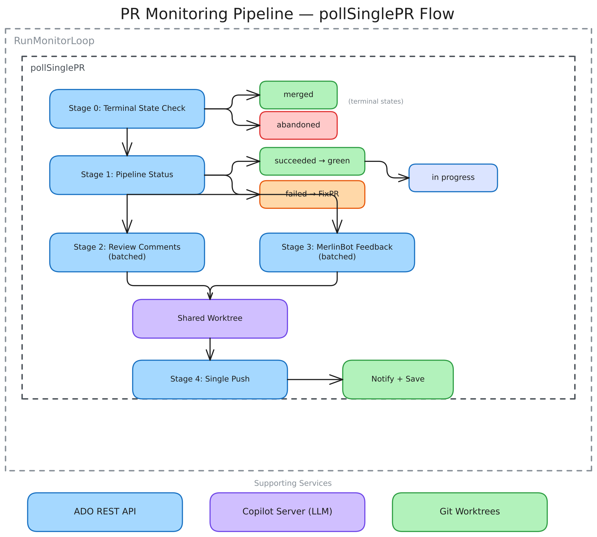

# PR Monitoring Architecture

Otto's PR autopilot continuously monitors tracked pull requests, automatically fixing pipeline failures, responding to review comments, resolving merge conflicts, and addressing MerlinBot feedback. This document details how the system works, with a focus on Azure DevOps (ADO).

## Overview

## PR Document Lifecycle

Each tracked PR is stored as a YAML+markdown file at `~/.local/share/otto/prs/{provider}__{id}.md`. The YAML frontmatter contains structured state; the markdown body logs fix history.

### States

PRs move through these states:

- **watching** → **fixing** (pipeline failed, auto-fix in progress) → back to **watching** (fix applied, awaiting pipeline)
- **watching** → **green** (pipeline succeeded) → back to **watching** (new push or comment fix triggers pipeline)
- **fixing** → **failed** (max attempts exhausted)
- **watching** → **merged** or **abandoned** (terminal states, reaped after 24h)

### Stage Tracking Fields

| Field | Type | Purpose |
|-------|------|---------|
| `status` | string | Overall state (watching/fixing/green/failed/merged/abandoned) |
| `pipeline_state` | string | Pipeline status (pending/running/succeeded/failed/unknown) |
| `feedback_done` | bool | All review comments resolved |
| `merlinbot_done` | bool | MerlinBot feedback addressed |
| `has_conflicts` | bool | Merge conflicts detected |
| `fix_attempts` | int | Number of code fix attempts completed |
| `max_fix_attempts` | int | Limit before marking as failed |
| `seen_comment_ids` | []string | Composite keys (threadID:commentID) to prevent re-processing |
| `waiting_on` | string | Human-readable summary computed from above fields |

## Poll Cycle: Stage by Stage

### Stage 0: Terminal State Check

Fetches the PR's live status via `GetPR(url)`. If the PR is **completed**, it's marked as `merged`. If **abandoned**, it's marked accordingly. Both are terminal states — the PR is saved and skipped in future polls. If merge conflicts are detected (`mergeStatus="conflicts"`), `ResolveConflicts()` is called. The PR title is also synced from live metadata on each poll.

### Stage 1: Pipeline Status

Calls `GetPipelineStatus(prInfo)` to get all builds and their overall state:

- **Succeeded** — if the PR wasn't already `green`, it's marked `green` and a `PR_GREEN` notification is sent. Processing continues to stages 2–3 for comments/MerlinBot.
- **Failed** — if `fix_attempts < max`, `FixPR()` is called. Otherwise the PR is marked `failed` and a `PR_FAILED` notification is sent.
- **In progress / pending / unknown** — if the PR was previously `green`, it's moved back to `watching` (a new push was detected).

**ADO API:** `GET /_apis/build/builds?branchName=refs/pull/{id}/merge` returns all builds for the PR. Builds are deduplicated by pipeline definition, keeping only the most recent per definition.

### Stage 2: Review Comments (Batched)

Calls `GetComments(prInfo)` to fetch all comment threads. MerlinBot-authored and system comments are filtered out. Unresolved comments are tracked for the `feedback_done` flag. Each new comment (identified by composite key `threadID:commentID` against the `seen_comment_ids` set) is evaluated by `evaluateComment()`, which may commit a fix to the shared worktree.

### Stage 3: MerlinBot (Batched)

Finds all MerlinBot-authored comment threads. If a thread contains "no AI feedback", it's resolved immediately. Remaining unresolved threads are sent to the LLM in a single batch evaluation. For each thread, the LLM decides: **FIX** (apply code fix, reply, resolve), **WONT_FIX** (reply with reason, resolve), or **BY_DESIGN** (reply with reason, resolve).

### Batched Push

Stages 2 and 3 share a **single clean worktree**. Each comment fix and MerlinBot fix commits locally without pushing. After all stages complete, one `gitPush()` sends all commits at once — triggering only **one** pipeline run instead of N. After pushing, `mergeBack()` syncs the changes to the user's local worktree.

## FixPR: Two-Phase Pipeline Repair

When a pipeline fails, FixPR runs a two-phase process with a 15-minute timeout:

### Phase 1: Diagnosis + Classification

Collects build logs from all failed/partiallySucceeded/canceled builds. For each, fetches the build timeline (`GET /_apis/build/builds/{id}/timeline`) to find failed tasks, then fetches raw logs (`GET /_apis/build/builds/{id}/logs/{logId}`) and extracts error context (±5 lines around `##[error]` markers).

The logs are sent to the LLM with a prompt requiring a structured classification: either `CLASSIFICATION: INFRASTRUCTURE` or `CLASSIFICATION: CODE`.

**Infrastructure path:** Queues fresh builds (never retries individual jobs — in-place retries cause artifact conflicts). Does NOT count against fix attempts. Uses `GET /_apis/build/builds/{id}` to get the definition ID and source version, then `POST /_apis/build/builds` to queue a new build with the same definition.

**Fallback heuristics** (if LLM doesn't include the marker): matches patterns like "infrastructure issue" + "retry the build" + "no code changes needed".

### Phase 2: Code Fix

Creates an LLM session in a clean worktree, sends the diagnosis with "fix the identified issues", and the LLM edits files directly in the worktree. The fix is committed and pushed via `gitCommitAndPush()` with a message like "fix CI failures (attempt N)", then `mergeBack()` syncs to the user's local worktree.

After the fix, `fix_attempts` is incremented. If it reaches `max_fix_attempts` (default 5), the PR is marked `failed`, a comment is posted on the PR, and a notification is sent.

## Merge Conflict Resolution

When ADO reports `mergeStatus="conflicts"`, ResolveConflicts runs with a 10-minute timeout:

1. Fetch latest from origin
2. Capture branch context (commits, diff stats)
3. Attempt `git rebase` onto target branch — if clean, force-push and done
4. If conflicts exist, identify conflicted files and create an LLM session with the branch commits (intent), diff stats, and conflicted files
5. The LLM resolves conflict markers, runs `git add` and `git rebase --continue`
6. Verify rebase completed (no `REBASE_HEAD` remaining)
7. Force-push the rebased branch

## Comment Evaluation

Each review comment is evaluated by an LLM with surrounding code context (±10 lines):

| Decision | Action |
|----------|--------|
| **AGREE** | LLM fixes code, commits, replies "Fixed in {hash}" |
| **BY_DESIGN** | Replies with explanation, resolves as by-design |
| **WONT_FIX** | Replies with explanation, resolves as won't-fix |

The LLM has access to the full repository via the worktree, not just the diff, so it can understand the broader context when deciding whether to agree or push back.

## ADO REST API Summary

| Operation | Method | Endpoint |
|-----------|--------|----------|
| Get PR metadata | GET | `/_apis/git/repositories/{repo}/pullrequests/{id}` |
| Get builds for PR | GET | `/_apis/build/builds?branchName=refs/pull/{id}/merge` |
| Get build timeline | GET | `/_apis/build/builds/{id}/timeline` |
| Get build log | GET | `/_apis/build/builds/{id}/logs/{logId}` |
| Queue fresh build | POST | `/_apis/build/builds` |
| Get comment threads | GET | `/_apis/git/repositories/{repo}/pullrequests/{id}/threads` |
| Post comment thread | POST | `/_apis/git/repositories/{repo}/pullrequests/{id}/threads` |
| Reply to thread | POST | `.../{id}/threads/{threadId}/comments` |
| Resolve thread | PATCH | `.../{id}/threads/{threadId}` (status: 2=fixed, 3=wontFix, 5=byDesign) |

**Authentication:** Entra ID bearer tokens via `az account get-access-token`, cached and refreshed transparently. Falls back to PAT if `az cli` is unavailable.

**Rate limiting:** HTTP 429 triggers exponential backoff (1s, 2s, 4s...). HTTP 203 indicates token expiry — cache is invalidated, token refreshed, request retried once.

## Notifications

Otto sends Microsoft Teams notifications via Power Automate webhooks for key PR events:

| Event | Trigger | Location |
|-------|---------|----------|
| `pr_green` | Pipeline succeeds (first time) | pollSinglePR |
| `pr_failed` | Max fix attempts exhausted | FixPR (sole owner) |
| `comment_handled` | New comments processed | pollSinglePR |

Each event type is sent from exactly one code location to prevent duplicate notifications.
